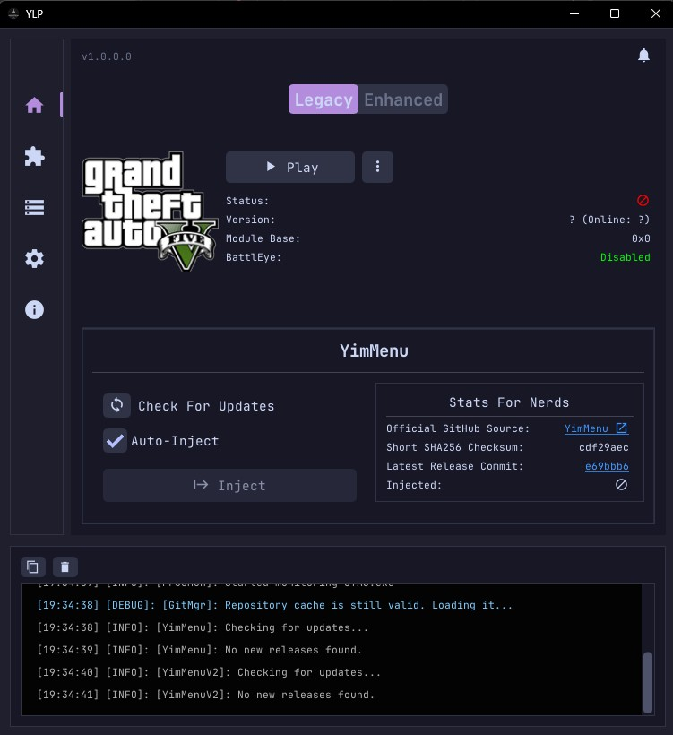

# About

A launchpad for YimMenu Legacy and YimMenuV2 with opt-in automatic injection.

## Features

### Mod Management

- Downloads YimMenu and YimMenuV2 with the press of a button.
- Automatically checks for new releases of downloaded menus on init as well as on request.
- Optional lightweight process monitor (required for auto-inject).
- Automatically injects the menu precisely at the landing page. No manual configurations required.

### Lua Script Management

- Parses all Lua repositories from [YimMenu-Lua](https://github.com/YimMenu-Lua) (Legacy only).
- Download/Enable/Disable/Delete Lua scripts right from the UI.
- Automatically checks for new releases of downloaded Lua scripts on init.

### Standalone DLL Injector

- Add custom DLL files and inject them into any process (default, no manual mapping).
- Any injected file will remember its last target process and automatically select it if it's running.

>[!Note]
> For returning users, the legacy **Python version of YLP** is **no longer supported**.
> Automatic updates from that version will not work anymore.
> However, you can still access its full source code under the [legacy branch](https://github.com/xesdoog/ylp/tree/legacy_ylp_python).

## Getting Started

1. Download the latest version from the [Releases](https://github.com/xesdoog/ylp/releases) page.
2. Move it to your preferred location.
3. Run **YLP.exe**. No installation required.
4. The built-in updater will keep you up to date.

> [!Note]
> Windows will flag the executable on first launch. You'll need to whitelist both the executable and its data folder (`%AppData%\YLP`) in your anti-virus.

## Feedback & Issues

Please report any bugs or feature suggestions on the [Issues](https://github.com/xesdoog/ylp/issues/new/choose) page.

## Themes

Visit the [themes section](./docs/themes/Readme.md) to read more about UI themes.

### Thank You

A huge thanks to the open source community and their immense contributions. You can find out more in the [Third Party](./docs/thirdparty/Readme.md) section.

------------------------------------------------------------------------

> [!Important]
> YLP is provided **as is**, without any warranty of any kind, express or implied.
> The author shall not be held liable for any damages, data loss, or issues arising from the use or misuse of this software.
